# GLOBAL IMAGE COMPOSOSITING AND INDEX CALCULATIONS

Author: Simon Ramsey

Contact: simon.ramsey@unimelb.edu.au

Script: https://code.earthengine.google.com/47cca57ba6a06c790e8b7c5099f8114d?noload=true

Acknowledgements: Development of these scripts were funded and supported by Dr Suzanne Mavoa (NHMRC Early Career Fellowship #1121035).

### DESCRIPTION

This script for Google Earth Engine (https://code.earthengine.google.com/) can be used to produce cloud-free and atmospherically corrected satellite imagery for Landsat 5, 7, 8 and Sentinel-2 using the median pixel compositing method. This 
method takes the median pixel value across each band for the image collection over the specified
time period. This has the benefit of aiding to remove clouds (which have a high value) and 
shadows (which have a low value).

The script can be accessed here: https://code.earthengine.google.com/47cca57ba6a06c790e8b7c5099f8114d?noload=true

This script also calculates indices commonly used in vegetation and urban studies:
* NDVI
* EVI
* MSAVI2
* NDWI
* NDSI
* UI
* NDBI

More information about each of these indices is available at the end of this document. For longitudinal studies incorporating multiple Landsat sensors, adjusted NDVI values are available using the adjustments calculated by Roy et al (https://www.sciencedirect.com/science/article/pii/S0034425715302455).

#### NOTES
Exported single band imagery (e.g. indices) will appear greyscale when displayed in a GIS environment. Display settings can be set when opened in external software e.g. QGIS. When displaying multi-band imagery, such as a true colour composite, ensure that the correct bands representing the red, green and blue channels are displayed. For example, for Landsat 8, Red = Band 4, Green = Band 3, Blue = Band 2.
 
The Scan Line Corrector (SLC) on board Landsat 7 failed on May 31, 2003. Landsat 7 imagery
after this data may contain data gaps and striping.

If no imagery is produced, check that the selected dates are within the lifespan of the 
satellite platform. For Sentinel-2, top-of-atmosphere imagery has been available longer 
than surface reflectance.

### GETTING STARTED WITH GOOGLE EARTH ENGINE
New users will need to create an account (https://earthengine.google.com/new_signup/)

The Google Earth Engine interface consists of three panels and an interactive map.

The left panel contains three tabs:
* Scripts - For managing user scripts and examples.
* Docs - Documentation for Earth Engine objects and methods.
* Assets - For the upload and management of assets e.g. shapefiles.

The middle panel contains the scripting interface.

The right panel contains three tabs:
* Inspector - For querying map results
* Console - For printing output from within the script.
* Tasks - Manages import and export

#### Earth Engine interface
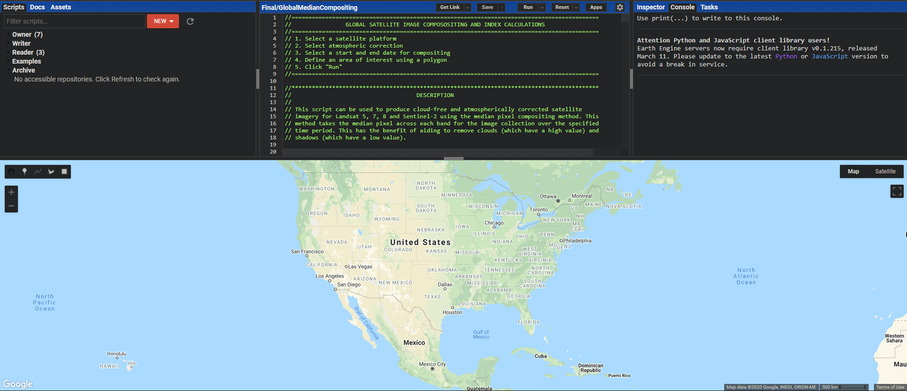

The geometry tools can be used to create point, line and polygon objects.
#### Create geometry
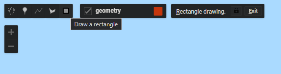

#### Import geometry
Alternatively, geometry objects can be loaded using the Asset tab in the left panel.

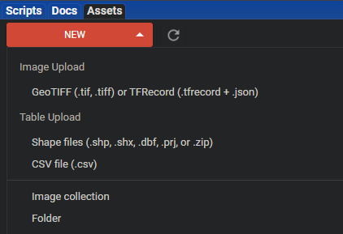

### PROCEDURE
The user will need to set the following variables within the script:
1. Select a satellite platform
2. Select atmospheric correction
3. Select a start and end date for compositing
4. Select the polygon defining the study area boundary

#### 1. SATELLITE PLATFORMS

 PLATFORMS | Landsat 5 | Landsat 7 |  Landsat 8   |  Sentinel-2A | Sentinel-2B                             
-----------|-----------|-----------|--------------|--------------|------------
 launched: | 1984-01-01 | 1999-01-01 | 2013-04-11 | 2015-06-23 | 2017-03-28
 returned: | 2012-05-05 | active | active |  active | active
 repetition: | 16 days | 16 days | 16 days |  10 days | 10 days
 resolution: | 30 meters | 30 metres | 30 metres |  10-60 metres | 10-60 metres

Note: Sentinel-2 band resolution is 10m for visible and near infrared bands, and 20m for red-edge and short wave infrared bands. Landsat thermal infrared bands are collected at a coarser spatial resolution and resampled to 30 m.

The platforms names have been shortened in the script to a letter and number combination e.g. L8 for Landsat-8. 
Enter either L5, L7, L8 or S2 as the value for the variable between the quotations to set a satellite platform. If left blank, the script defaults to Sentinel-2

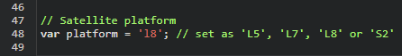

#### 2. SET ATMOSPHERIC CORRECTION

Select whether to use atmospherically corrected imagery.
If left blank top-of-atmosphere reflectance will be selected.

Surface reflectance imagery has been pre-processed to reduce the affects of atmosphere on imagery.
Top-of-atmosphere uses the "at sensor" imagery.
Surface reflectance imagery, if available, should better represent the actual reflectance from the earths surface.

Note: Sentinel-2 surface reflectance data is available from 2017-03-28 onwards.
Sentinel-2 top-of-atmosphere data is available from 2015-06-23 onwards.

Entering SR between the quotations uses surface reflectance imagery, if left blank top-of-atmosphere is used.
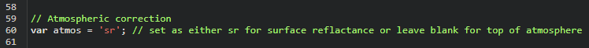

#### 3. SET TIME FRAME

Set start and end dates for the composite. Seasonal or annual time frames are recommended.
Select a time frame appropriate for the satellite platform chosen. Shorter time frames
will contain more cloud cover depending on season and may contain data gaps.

Enter the chosen start and end date between the quoatations for the appropriate variables in the format "YYYY-MM-DD".

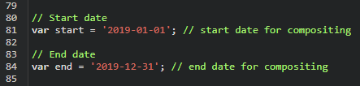

#### 4. SET STUDY AREA

Define a study area using a geometry either created within Earth Engine or uploaded as an asset.
Polygons can be created using the geometry tools in the top-left of the interactive map window. Select the polygon tool and define the corners of the polygon by clicking on the interactive map.
To use a pre-defined geometry, upload it as an asset. 
Ensure the name of the area variable matches the name of the geometry.

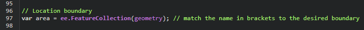

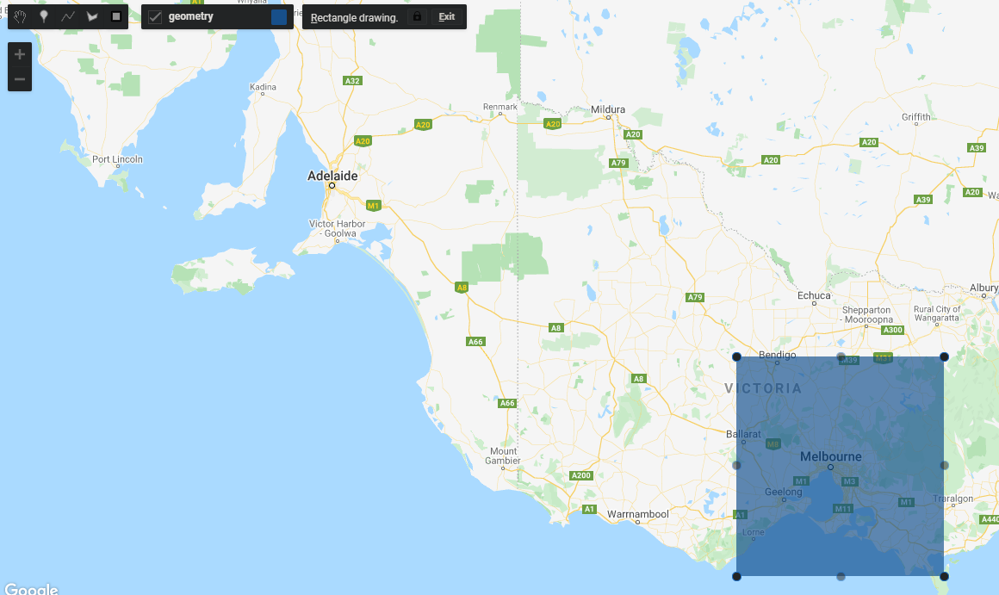

Once these four variables are set, click RUN in the top right of the scripting panel, or click Ctrl+Enter on the keyboard.

#### RESULTS
Information about the selected inputs will be displayed in the console, including the satellite platform and start and end dates for the composite imagery.

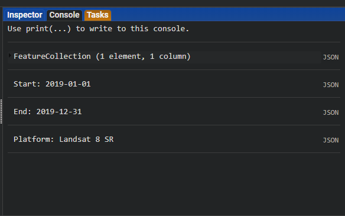

After running the script, a layers menu will appear in the top right of the interactive map window, which can be expanded by moving the mouse over it. By default, a true-colour image is displayed.

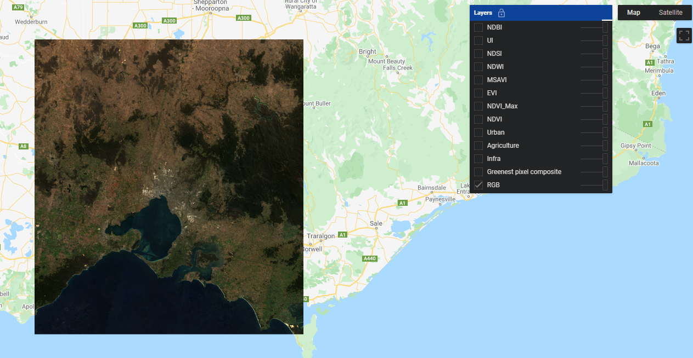

Other band combinations and spectral indices can be displayed using the tickboxes and their transparency can be adjusted using the sliders. The first object on the list will be displayed on top of the objects below it.

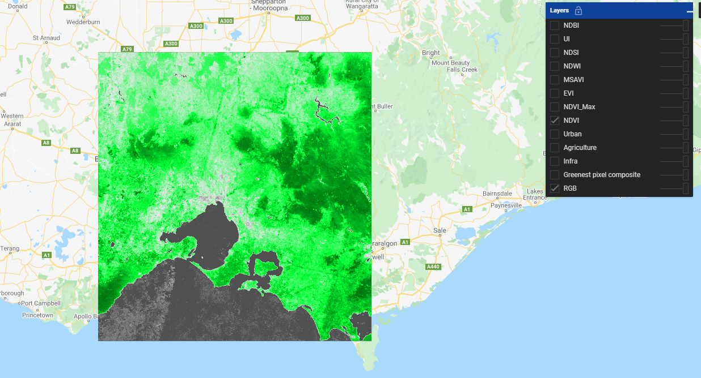

#### EXPORT
To export imagery, click the highlighted tasks tab in the right panel.
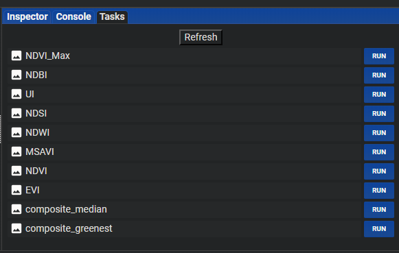

Click an image file and select RUN to export.

The file parameters can be set in the panel that opens. Images can be exported directly to the associated Google Drive account.

The other properties define the file name and export folder.

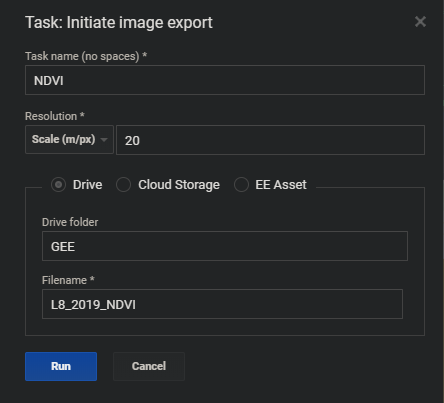

Once complete, the imagery can be downloaded from Google Drive and opened in a GIS (e.g. QGIS).

### IMAGERY

#### TRUE COLOUR IMAGE

Composite true colour image where the median pixel values are selected across selected time period.

#### GREENEST PIXEL COMPOSITE

Composite true colour image at maximum photosynthetic activity (NDVI) across the time period. Water and impermeable surfaces may appear cloudy as cloud cover may have a higher NDVI value than these surfaces.

#### INFRA (VEGETATION FALSE COLOUR)

R: NIR, G: RED, B: GREEN

Median pixel composite. Vegetation appears vibrant red. Hardwood trees often appear lighter than Conifers.
Soils vary from dark to light browns and urban areas can appear cyan blue, grey and yellow.
Grasslands appear yellow. Other vegetation appears as less vibrant shades of green.

#### AGRICULTURE FALSE COLOUR

R: SWIR1, G: NIR, B: BlUE

Median pixel composite. Crops appear bright green. Bare earth appears magenta. Grasslands appear yellow.
Other vegetation appears as less vibrant shades of green.

#### URBAN FALSE COLOUR

R: SWIR2, G: SWIR1, B: NIR

Median pixel composite. Vegetation appears green. Urbanized areas are represented by white, gray, or purple.
Soils, sand, and minerals are shown in a variety of colors.
Snow and ice appear as dark blue, and water as black or blue.

### SPECTRAL INDICES

#### NDVI - NORMALISED DIFFERENCE VEGETATION INDEX

(nir - red) / (nir + red)

The value range of an NDVI is -1 to 1.                       
Negative values of NDVI (values approaching -1) correspond to water.           
Values close to zero (-0.1 to 0.1) generally correspond to barren areas of rock, sand, or snow.
Low, positive values represent shrub and grassland (approximately 0.2 to 0.4), while high values indicate temperate and tropical rainforests (values approaching 1).

####  EVI - ENHANCED VEGETATION INDEX

(nir - red) / (nir + 6 * red - 7.5 * blue + 1)

Seeks to address the limitation of NDVI which can oversaturate in high biomass areas.
The range of values for the EVI is -1 to 1.                
Healthy vegetation generally falls between values of 0.20 to 0.80. 

#### MSAVI - MODIFIED SOIL-ADJUSTED VEGETATION INDEX 2

(2 * nir + 1 - sqrt(pow((2 * nir + 1), 2) - 8 * (nir - red)) ) / 2

Seeks to address the limitation of NDVI when applied to areas with a high degree of exposed soil. Unlike other soil-adjusted vegetation indices, MSAVI2 removes the need to explicitly specify the soil brightness correction factor.
MSAVI2 represents vegetation greenness with values ranging from -1 to +1.              

#### NDWI - NORMALISED DIFFERENCE WATER INDEX

(nir - swir1) / (nir + swir1)

Values of water bodies are larger than 0.5. 
Vegetation has much smaller values         
Built-up features have positive values between zero and 0.2.

#### NDSI - NORMALISED DIFFERENCE SNOW INDEX

(green - swir1) / (green + swir1)

Snow is highly reflective in the visible part of the EM spectrum 
and highly absorptive in the near-infrared or short-wave infrared part of the spectrum, 
whereas the reflectance of most clouds remains high in those same parts of the spectrum.
Values range from -1 to 1 with large positive values indicating snow or cloud cover.   

#### UI - URBAN INDEX

(swir2 - nir) / (swir2 + nir)

Build-up areas and bare soil reflects more SWIR than NIR.                                     
Higher values generally represent the impervious surfaces found in build-up areas.            
Negative value of UI represent water bodies.                                                  
UI value for vegetation is low.                                                               

#### NDBI - NORMALISED DIFFERENCE BUILT-UP INDEX

(swir1 - nir) / (swir1 + nir)

Build-up areas and bare soil reflects more SWIR than NIR.        
Higher values generally represent the impervious surfaces found in build-up areas.
Negative value of NDBI represent water bodies.   
NDBI value for vegetation is low.
